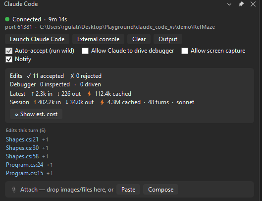
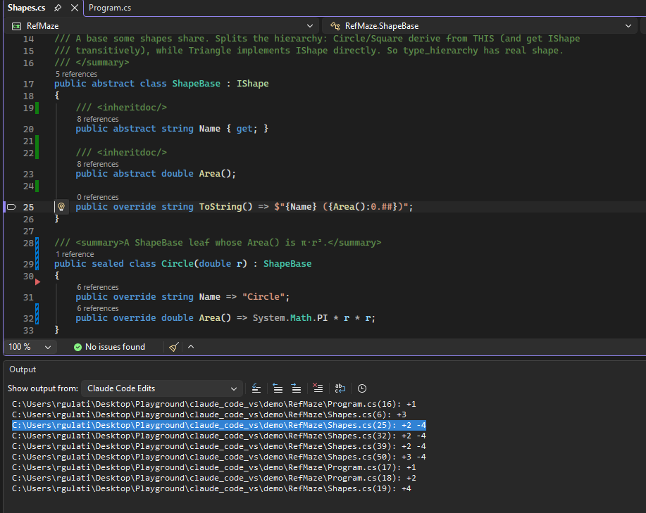

# Quality of life: the terminal, notifications, and attachments

The deep guides ([`DEBUGGER.md`](DEBUGGER.md), [`SEMANTIC.md`](SEMANTIC.md), [`TESTING.md`](TESTING.md)) cover what Claude can *do*. This one covers the features that smooth the daily loop of working with it: where `claude` runs, how you find out it needs you, and how you hand it things that aren't text.

- [Claude in the IDE's own terminal](#claude-in-the-ides-own-terminal) (1.13.0)
- [Jump to what Claude changed](#jump-to-what-claude-changed) (1.21.0)
- [Notifications](#notifications) (1.11.0)
- [Attach a screenshot, or any file](#attach-a-screenshot-or-any-file) (1.12.0)
- [Troubleshooting](#troubleshooting)

## Jump to what Claude changed

When Claude says it changed `Pricing.cs:22`, that text is the CLI's own output in the terminal, and Visual Studio's terminal has no link handling the extension can hook into. So the jump targets live in the panel instead.

Every change gets a row: click it and the file opens at that line. It gives you a little more than the terminal does - Claude prints one reference per edit, while the panel lists **one row per changed region**, so a single edit that touched three separate places gives three jump targets, each with its own `+3 -1` count.

The list is scoped to the **current turn**, which keeps it short enough to never need scrolling in normal use. It stays put while you type your next message and is replaced only when the next turn actually edits something, so it is never yanked away mid-read. When there is nothing to show it disappears completely and costs no panel height.

It matters most with **run wild** on. No diff opens in that mode, so this list is the only record of what changed.

A file that was largely rewritten collapses to a single `whole file, 340 lines` row rather than flooding the section with hundreds of links.

### The same list for the whole session

The panel covers the current turn. For everything since the session started, the Output window grows a **Claude Code Edits** pane:

The lines render as plain text rather than hyperlinks, but they are real task items, so **`F8` steps through them** exactly as it steps through build errors - each press opens the next change. Handy for walking a long session's worth of edits without touching the mouse.

### What it doesn't catch

Only edits Claude makes through its editing tools appear. If it changes a file by running a shell command (a `sed -i`, a redirect), the extension never sees it and it won't be listed. The section is called *Edits* rather than *Changes* for that reason.

## Claude in the IDE's own terminal

**Launch Claude Code** opens `claude` inside Visual Studio's own docked **Terminal** tool window - the same terminal group as Developer PowerShell - instead of a separate `cmd.exe` console floating over your desktop. It docks, splits, and tabs like any other VS terminal, and it is already connected to the IDE (no `/ide` needed).

Prefer a standalone window? The **External console** button next to Launch starts `claude` in the old separate console instead - useful for a second monitor, or because the docked tab lives and dies with Visual Studio while an external console keeps running after you close the IDE.

### How it works

VS 2026's terminal engine is exposed as a brokered service (`ITerminalService`) that is undocumented - no NuGet package, no docs page - so the extension loads it by reflection from the VS install directory at runtime, the same pattern it uses for the Test Explorer engine. Because an undocumented surface can change or vanish in a VS update, the native launch is guarded end to end: any failure, and any stall longer than ~10 seconds (a cold ServiceHub, for instance), logs a warning to **Output > Claude Code** and falls back to the external console automatically. You always get a terminal.

The launch registers a temporary "Claude Code" terminal profile to carry the command, then deregisters it immediately, so your **View > Terminal** profile dropdown stays clean.

### Known quirks

- **After a VS restart, the old Claude Code tab comes back as Developer PowerShell.** Visual Studio restores terminal tabs across restarts, but always with the default shell - there is no API to opt a tab out, and replaying `claude` would be wrong anyway (the old session's bridge port is stale). Close the leftover tab and click **Launch Claude Code** again.
- **Each click of Launch opens a new tab** (or a new external console), the same as launching twice always has. Each is a separate `claude` session talking to the same bridge.
- **Closing VS closes the docked `claude`.** That is the nature of a docked tab. If you want a session that outlives the IDE, use **External console**.

## Notifications

An in-IDE heads-up for when you are working in another window while Claude cooks:

- **"Claude finished responding."** - when a turn ends, a notification bar appears across the top of the Visual Studio main window (it auto-dismisses after 15 seconds), and if VS is not your foreground app, its taskbar button flashes a few times. The flash is deliberately bounded - a few blinks, then the button stays highlighted - not a nag that blinks until you click.
- **"Claude needs your input."** - when Claude hits a permission prompt or goes idle waiting for you, a bar appears and stays up until you dismiss it (or the next notification supersedes it). It also lands in the panel's activity feed.

One notification shows at a time; a new one replaces the previous. The **Notify** toggle in the panel mutes both. It defaults to **on** - it is a convenience, not a safety gate, so unlike the two safety toggles it does not reset itself each session.

Under the hood, turn-end rides the token-usage hook the extension already installs (no extra hook), and needs-input comes from a small `Notification` hook (`vs-notify-hook.ps1`) that POSTs to the bridge.

## Attach a screenshot, or any file

Pasting a screenshot into the Claude Code CLI on Windows silently does nothing (a [long-open upstream gap](https://github.com/anthropics/claude-code/issues/26679)), and a screenshot is not a file you can drag from anywhere. The panel's attach tray closes that gap:

1. Take your capture (Win+Shift+S), then click **Paste** in the panel (or press Ctrl+V with the panel focused, or drop files from Explorer onto it). Copied or dragged **text** works too (1.15.0): it opens in a composer dialog to review and edit first - line breaks, trimming, live token estimate - then **Attach** stages it as a `.txt` with a chip and an `@`-mention. The **Compose** button opens the same editor empty for writing multi-line prompt material from scratch.
2. The extension stages the attachment and pushes an `@` reference straight into the CLI's input box - the same `at_mentioned` protocol message the official VS Code plugin uses, verified to deliver the actual pixels to the model, not just a path.
3. Type your question around the chip and send.

The text path in action - a paste opens in the composer for review (edit freely, watch the live token estimate), Attach turns it into a staged chip, and the `@` reference lands in the CLI ready for you to type around:

What makes the tray more than a paste button:

- **Token cost up front.** Every attachment shows an estimated token cost before you send - on the chip's tooltip and totaled next to the tray. A full-screen or 4K shot lands near ~1.5k tokens (the API downscales), a tight crop costs a fraction of that, and a 2 MB JSON log announcing *≈212k tokens* is your cue to ask Claude to Grep it instead of reading it whole.
- **Every format attaches.** Images and PDFs and text are read directly; BMPs are transcoded to vision-ready PNGs; formats Claude cannot read directly (Excel, video, archives) attach as a labeled 🧰 chip - Claude gets the path and reaches for a script or tool on its own. Nothing is hard-rejected.
- **Nothing lands in your repo.** Files already inside your workspace are referenced in place, never copied. Everything else (including pasted screenshots) is staged in `.claude/attachments/` behind a self-ignoring gitignore, and staged copies are pruned after 7 days.
- **Chips are re-sendable.** Click a chip to push its `@` reference again; ✕ removes it (and deletes the staged copy).
- **The tray belongs to the open solution.** Close the solution or open another one and it resets itself - a chip is a path scoped to the workspace it was staged from, so carrying it across would push references the next session can't resolve. Same semantics as the Clear button: staged copies are deleted, files referenced in place are only unlisted.

Direct-read images must be PNG/JPEG/GIF/WebP under 5 MB; bigger ones still attach, with a downscale note.

### Where focus goes (by design)

Pushing an `@` reference and *sending* it are two different moments, and the extension moves keyboard focus based on which one you're in:

- **"I'm done - send it" surfaces focus the Claude terminal for you**, so Enter sends immediately: every editor context-menu action (Explain, Add to Chat / Alt+K, Fix Errors, Generate Documentation, Add Comments, Fix This Test), a **chip click** (re-mention), and the composer's **Attach** button.
- **Raw paste and drag-drop keep focus in the panel** - deliberately. Staging often happens in batches (three screenshots, a couple of log files), and yanking focus to the terminal after the first paste would fight the second. When the batch is done, click any chip - it re-mentions *and* hands you the terminal.

Focus is best-effort: a session the extension launched (docked tab or external console) can always be focused; a terminal you started yourself and connected with `/ide` has no handle the extension knows, so focus stays put and you click the terminal as before.

## The editor context menu

Right-click in any editor: the **Claude Code** flyout puts the common asks one click away. It sits mid-menu, below the Go To navigation block - never claiming the top slot.

The separator is the design: **above it, actions that give Claude context** - *Explain* stages the selection (or, with nothing selected, the whole file) with an instruction header, and *Add to Chat* (`Alt+K`, the same shortcut as the official VS Code extension) `@`-mentions the file and line range in place. **Below it, actions that ask Claude to change the file** - *Fix Errors* bundles the selection (or file) with its actual Error List diagnostics and asks for the smallest correct fix, re-verified with `getDiagnostics`; *Generate Documentation* and *Add Comments* resolve the **function at your caret** through Roslyn (no selection needed - an accessor resolves to its property) and mention its exact line span, asking for style-matched doc comments, or explanatory comments only where the code isn't self-explanatory; *Fix This Test* (appears in test files) hands Claude the whole loop - run with `vs_run_test`, stop at the throw or catch the flaky iteration under the debugger, fix, re-run.

Rules every entry follows: **insert-not-submit** (references land in the CLI composer; Enter is yours), each stages a **self-describing** `.txt` (`explain-Program.cs-L17-20.txt` - the reference says what it is), the action **focuses the claude terminal** so Enter sends immediately (see [Where focus goes](#where-focus-goes-by-design)), no session running means the action **launches one**, and every edit still arrives through the **diff gate**.

The code an action points at shows up in the attach tray too, as a chip like `📄 Program.cs #L18-24`. That is the retry path: if the CLI drops a reference because it arrived mid-turn, click the chip to send it again. It also means a cold start loses nothing - fire an action with no session running and both the note and the reference queue up, then deliver in order the moment the CLI connects. Removing one of those chips never touches your source file; only staged copies (screenshots, pasted text) are deleted with `✕`.

## Add to Chat in Solution Explorer

The editor flyout points Claude at the file you're *in*. **Add to Chat** on the Solution Explorer right-click menu points it at everything else: select one or more files, right-click, and each is `@`-mentioned whole-file - no line ranges, no typing paths.

- **Folders work too**, and they aren't expanded here: the folder itself is mentioned and the CLI walks the tree, so `@Rules` costs one reference instead of one per file.
- **Multi-select is the point** - "look at these three files" is select + right-click, and a selection spanning projects works the same way. Project and solution nodes deliberately have no entry; "read this whole project" is a different ask.
- **The references arrive as chips** in the panel's attach tray, so each one keeps its token estimate and click-to-re-mention, and a selection made before Claude connects delivers itself on connect. Twenty items per invocation - the tray's chip bound.

## Troubleshooting

- **Clicking Launch again does nothing:** by design - a session is already connected (or one is still starting), and the activity feed says which. One docked session per VS window is the model the panel is built around: its status, stats and toggles describe *the* session. Want a second one anyway? **External console** always launches, and `/ide` from any terminal connects it.
- **`claude` opened in a separate console window instead of the docked terminal:** the native path failed or timed out and fell back - the reason is logged in **Output > Claude Code** (look for "Native VS terminal"). Everything still works; the fallback is by design.
- **The Claude Code terminal tab turned into Developer PowerShell after restarting VS:** expected - see [Known quirks](#known-quirks). Close it and Launch again.
- **An attachment chip didn't show up in the CLI's input box:** the CLI drops the reference if it arrived mid-turn or while its agents view was focused. Click the chip to send it again; chips staged before Claude connects send themselves on connect.
- **The `@` reference appeared in the CLI's input box, but Enter doesn't send it:** you're in one of the two cases that don't auto-focus (see [Where focus goes](#where-focus-goes-by-design)): a raw paste/drop into the panel (deliberate - batch staging), or a `/ide`-connected terminal the extension didn't launch (no handle to focus). Click any chip to re-mention *and* get the terminal focused, or click the terminal's input line. Corollary: an `@` reference in the input box always came from the panel - pasting an image straight into the terminal does nothing at all (see below).
- **Pasting a screenshot into the terminal does nothing:** expected, and not something this extension can fix - Windows terminals hand the CLI a character stream, never the clipboard's bitmap ([upstream #26679](https://github.com/anthropics/claude-code/issues/26679)). Shift+Insert and right-click paste are terminal-level and text-only, so they don't help either. Paste into the panel instead.
- **No notifications:** check the **Notify** toggle in the panel, and note the taskbar flash only happens when VS is *not* the foreground window.
